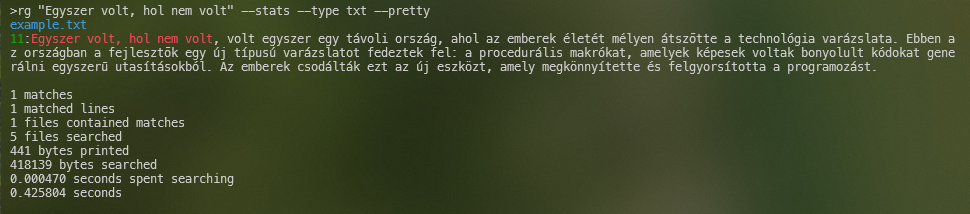
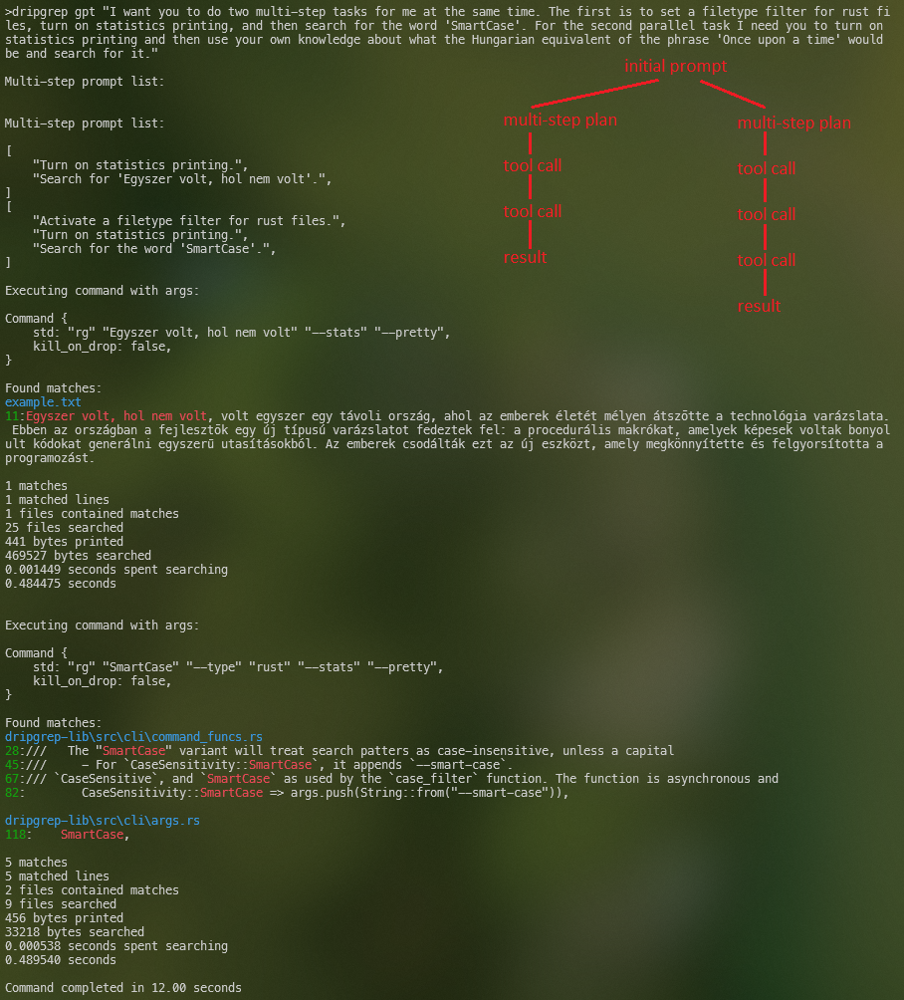

## dripgrep


Are you sick and tired of how "_free_" and "_fast_" ripgrep is? 

No? I'm not surprised. I bet you don't even know how to sail.

This project is an experimental, LLM-based wrapper for ripgrep, for those with the means, and the time, to introduce paid network calls into compilation and runtime.

<span style="font-size: 80%;">(Jokes aside, this _is_ a serious project (in a way), but it is not a serious attempt to make some sort of grep gpt. I'm not making this because I think it is a great idea worth pursuing on its own. Don't actually use this. Learn real command line tools, not this thing. Your children could one day find out. Consider your legacy. You are either part of the priesthood or an apostate. Now, go and <a href="https://github.com/BurntSushi/ripgrep/blob/master/GUIDE.md" target="_blank" rel="noopener noreferrer">pray</a>.)</span>

### Example
Let's grep .txt files for a phrase in a language I don't know, Hungarian:

Can your grep do <a href="https://twitter.com/tsoding/status/1756517251497255167" target="_blank" rel="noopener noreferrer" style="font-style: italic">thaaaat</a>_??_ This took four calls. One to plan, one for setting the filetype flag with txt option, one for setting the statistics flag, and then one for search. The --pretty flag is just hardcoded to be added on for now. 

To be clear, we are not telling the model a single thing that hints about ripgrep (which actually would only make things worse), and we aren't just saying "Come up with a command line entry that would do ________ with ripgrep.". Everything that builds up the command is Rust types.


We'd lose 3,000% of the luxuriousness of doing it with dripgrep by doing it with ripgrep directly. These people that must be constantly finding themselves in file-searching emergencies all the time would call it a 3,000% performance gain:


Here is another example demonstrating parallel tool calling. By default all tool calls made at the same time make progress concurrently, but you can choose to run them synchronously, or put them on their own os threads. This is a feature of <a href="https://github.com/frankfralick/openai-func-enums" target="_blank" rel="noopener noreferrer">openai-func-enums</a>. This example represents a total of 7 api calls were needed to complete this prompt, and 8 tool selections were made by the model (2 were called in parallel):



### Why?

There are a few (with more coming) LLMs with APIs that allow callers to present a set of "tools" or "functions" that the LLM can decide to invoke based on the context. This is an extremely powerful idea that I believe could eventually be a bridge that allows the power of these models to be applied to certain real-world problems in ways that are as meaningful as the application of LLMs to source code generation has been for the continued <a href="https://dayssincelastjavascriptframework.com/" target="_blank" rel="noopener noreferrer">proliferation</a> of javascript frameworks.

But...there are many practical issues. We are going to set aside how well models actually perform at planning steps and selecting tools; you can trust that this will not remain an issue for long. The point of this project is to be a reconnaissance mission. 

Many times the real problem doesn't reveal itself until you've solved others first. For the real work I'm contemplating, those first problems are a big lift that I don't want to go through only to then figure out I should have gone in a different direction. This project is a way for me to get my arms around a specific part of the problem - _a system that defines a large number of possible actions_ - without the action-defining part being a lot of work.

Specifically, I wanted to create a problem where we need to be able to present to an LLM the particulars of many more actions than the model's context window can hold (or should). ripgrep fit the bill.

### Softer-ware
When the great unwashed look at the state of image generation models they think, "Why would I want to automate the actual _control_ of an application to produce an image when we can have models that can produce an acceptable output directly?" Because that situation is rare. The sorts of deliverables that knowledge workers create aren't static. They are long-lived, fussed-over things that need to be manipulated in a deterministic way, later. AI-based code generation has had the impact it has had specifically because it produces _source code_. Not binaries. Not a picture of what the code looks like.

There are many domains that aren't so lucky that the medium their workers work in is plain text. Bringing the power of AI to bear in those domains may require that they get help with the "source code" and not the "binaries".

A practical example is architecture (as in architecture for buildings). Imagine we are designing a large building, and we are going to use Autodesk's Revit. After a lot of time spent entering commands into this tool, they'll produce a big pdf file that will go out into the world and do its thing; get submitted for permit, priced by contractors, used for construction. Looking at granular usage data across hundreds of architects over several years shows there are around 700ish "commands" they invoke in that tool.

There are many ways they can use the tool to get a deliverable that looks the same. But during the life of that project there will be heavy and continuous reworking of the thing that produces the drawings. Correcting mistakes, coordinating with other disciplines, scope changes, etc. Deterministic control of the source is required. The door to Room 758 actually does need to be a one-hour fire-rated door. The thought of AI producing a floorplan that is good and meets a required building program is believable, but the notion this can matter in the face of the practical realities of that kind of work, is not. 

Industry-altering automation might require granular actions. And lots of them. The thing you use to generate source code certainly does. _Type 'let'. Now a space. Now type 'mut' followed by another space. Next insert 'my_variable'. Now type ':'..._ I want to experiment a lot with granular actions and worry about abstracting them later.


#### What
This is basically a larger example built on top of <a href="https://github.com/frankfralick/openai-func-enums" target="_blank" rel="noopener noreferrer">openai-func-enums</a>, which allows definition of functions as enum variants, as well as containing features for dealing with larger systems. There are some rough edges in openai-func-enums, some of what I'm doing is not great, but again, we are figuring things out.

**Note: This library requires the [async-openai](https://github.com/64bit/async-openai), which requires that you have your api key in an environment variable called `OPENAI_API_KEY`.

#### Performance
When I say performance I mostly mean the model selecting the actions you expect and calling them with the arguments you expect. This project will serve as a way to test the effects of specific choices. That isn't implemented in any sort of rigorous way yet but will happen soon.

##### Relevance
The biggest weapon is embedding-based similarity search. If you inspect the build.rs file you will see several settings that give you to control at compile time over which model to use for embeddings as well as token budgets for various aspects of interactions. You also need to define a feature flag `compile-embeddings-all` which, when set, will cause embedding vectors for the combination of the name and description of your functions to be obtained. To be clear: compilation with this feature flag will make api calls which will cost money.

The vectors and some other details make a FuncEmbedding struct which gets serialized into an <a href="https://github.com/rkyv/rkyv" target="_blank" rel="noopener noreferrer">rkyv</a>-based object (a zero-copy deserialization framework for Rust worth knowing about about). I will bake the json representations of functions in as well. Also a little less than half the work of doing cosine similarity (the vector magnitudes) could be calculated at compile time and preserved as well.


##### Merging Mutually Exclusive Actions
If the description of an action evaluates as being very similar to a user prompt (relative to the collection of actions), then an action that describes doing the _opposite_ thing likely will rank very high also. This is bad. One of the functions shouldn't be presented to the model as an option at all, yet it is consuming a large amount of context window space that is limited. 

"Search binary files" and "Don't search binany files" are in the same embedding space as "Bespoke boat shoes"; the first two are going to be pretty close in the grand scheme of things. 

This can be mitigated by combining these things into a single action definition, with an argument that indicates yes or no. If you read the source you will see many pairs of ripgrep feature flags being treated as a single action with an `Enabled` arugment.

##### Semantic Isolation
What I mean by "semantic isolation" is that you want descriptions of actions to be as semantically differentiated as possible. Word choice really matters. The descriptions given to functions that are related may often contain references to the same notion, or contain the same or closely related words. Consider:


This:
```rust
    /// Sort search results by the given method
    SortResultsBy {
        sort_by: SortBy,
        sort_ordering: SortOrdering,
    },

    /// Searches for a pattern
    Search {
        pattern: String,
    },
```

vs. this:
```rust  
    /// Sort results by the given method
    SortResultsBy {
        sort_by: SortBy,
        sort_ordering: SortOrdering,
    },

    /// Searches for a pattern
    Search {
        pattern: String,
    },
```

This subtle difference has a dramatic impact on performance when it comes to tool selection. Inclusion of the word "search" in the first example will cause this "SortResultsBy" variant to be deemed high in relevance every time the user prompt says "search", and the user prompt will use that word or one of its next-door neighbors every time. Descriptions that avoid the inclusion of meaning that distracts makes a real difference.

And on this I think optimizations could be made. For example, you could start with an initial description of an action, ask for 25 alternate wordings, get vectors for them all, then find which have the smallest cosine similarity to other functions, or to a specific function that it is colliding with. I don't know. Interesting to consider though.

#### Contributing
LGTM! For real, if you want to add some non-ripgrep functionality to this I don't care. It only helps to make it bigger. Make clippy happy and --> LGTM probably. Suggestions as issues are also more than welcome. If you have some good idea for how to implement some of what I'm currently mailing it in on, like how I'm passing around information about what is going on and what happened last, for example, please do. I have thoughts about it but just not a big priority due to the real goal here.

#### Remaining
There some bits that are key for me that I am for sure going to, others I'm just thinking about.

##### Testing
The first thing on the "for sure" list is testing. I want some tests that aren't pass/fail but more like "% of the test that passed". Like if I come up with many ways to word a request such that any reasonable person would arrive at the same set of things, how does XYZ change to something like the token budget for functions alter the % of the test prompts that resolve to what we expect/hope will occur. Or, in the case where we are attempting to avoid/recover from it going off the rails, how does XYZ change to system functioning impact the rate at which it deals successfully with the varried ways of saying the same thing, and how many tokens it took. I guess those are the two ways I can think of to try to add some rigor into evaluating how adjustments to wording, argument variant culling, etc. impact things. What was the token consumption and at what rate is is resolving to what we hoped for.

##### Argument Variant Culling
In the same way this is culling functions that get presented I need to implement something to cull variants on argument enums that have too many variants. For ripgrep, supported filetype filters is one. It adds hundreds of tokens to include them all. So for now I've just got a handful in there, but will add the rest when making a solution for that. I want to be able to mark the ones at compile time that should have this feature, so that the json values for functions that don't involve arguments like that can be baked at compile time into the rkyv object.

##### Avoiding Bad States and Recovering From Bad States
Also a "for sure" thing. There are some typical ways GPT4 will blow it. On the "avoid" front an example is doing intermediate requests to check in with the model about what is going on. An example is at work I made a chat thing that has domain-expertise corpora. If you just blindly go back to the well every time they say something you will be disappointed with user reactions. An intermediate step asking "Hey, look at what has been going on, and look at this new prompt. Did they just change the subject and we should refresh part of the context provide, did they ask a more detailed follow up that warrants more context, or did they ask a follow up that warrant no context change?" So when a user asks "What do you mean by that?" We aren't composing a request that is going to lead to an answer that maybe makes no sense. It slows it down slightly, but robustness/consistency of answering well and having relavant context went way up. So I think the same thing could matter here. If you have some very long running thing that looks to be many steps, we might want to first find out if that's the nature of the request in the first place, and if we do have that situation, does it make sense to insert some intermediate steps to check in on what is going on and course correct if possible. 

One thing that will happen you can easily test, is show it three functions and have a prompt that clearly includes a fourth step that there isn't a function for. This can be avoided but not by showing it more functions. You need intermediate steps to get through that. Like "hey here was the initial prompt, here is what we already are planning to do, give us remaining single-action steps to do."

##### Smaller "Next Action" Model 
For certain real world actions I'm thinking about I've got a lot of data that could be used to augment the similarity filtering maybe. It would be interesting to think through being able to opt-in to an ML step so the functions presented end up being: all the functions marked as required, the first N ML-based predictions for most likely next action, and then ranked remaining functions based on similarity search if not present in similarity results. Something like that. I would have to come up with some contrived/artificial way to implement that in this thing but I think may be worth it. The issue with relying just on similarity search is that I'm trying to describe these things so they are differentiated. We aren't telling the model anything about ripgrep. Preventing it from using its own knowledge unless we tell it to. When it catches a wiff that it is being asked about something it knows about it goes worse (as far as I've seen). Might be nice to include some secondary way to check that what should be shown will be shown.

##### Action Preparation vs. Action Taking
If we are making a system with many features that we want an LLM to be able to control, we will need to be able to present it "functions" that correspond to real functions as we've been calling, but also we need to be able to show it possible "preparation" steps that it can take as if they are actions. Command line flag options are a good example. If we want to say "Search for files that contain the word fast, and only search in markdown files, and please print statistics at the end." then what we have on our hands is the need to let the LLM make a plan to do a couple of actions that build up the process that we want to start. 

Tools like clap clearly make this distinction between options/flags/args and the action command. But we aren't actually interested in just making CLIs so we need a way to more formally indicate what the thing actually is.

In the real world, completing that task with ripgrep is a single action as far as the boundary between me and the computer is concerned. If I'm inside that boundary then the steps suddenly get numerous. I need to type "rg". I need to consider what flags that come before the pattern I need. I need to type the pattern. I need to remember the file type flag and type it in "-t", and I need to type the right plain english name for the file type. Then execute. 

And on something like this where we need to compose series of real world actions we want to make, we need to be able to know if we are on the last preparation step so we can actually take the action we were building up in the first place, and not accidentally take the action prior to being ready. Such trouble.
